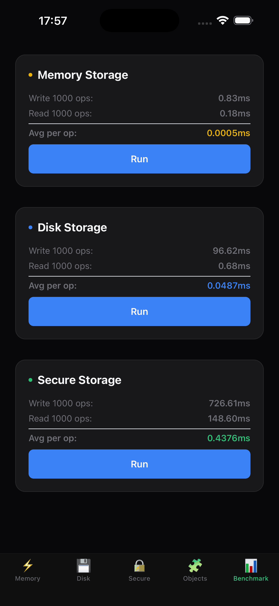
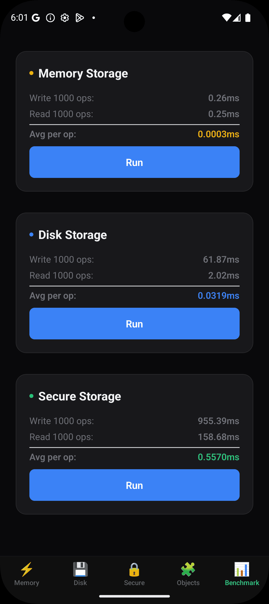

# react-native-nitro-storage 🗄️

> **The fastest, most complete storage solution for React Native.** Replace Zustand, MMKV, AsyncStorage, and Expo Secure Store with one lightning-fast, type-safe library.

[](https://www.npmjs.com/package/react-native-nitro-storage)
[](https://opensource.org/licenses/MIT)
[](https://nitro.margelo.com)

**react-native-nitro-storage** unifies **Memory** (global state), **Disk** (persistence), and **Secure** (keychain) storage into a single, blazing-fast C++ library built with [Nitro Modules](https://nitro.margelo.com). All operations are **100% synchronous** via JSI—no promises, no bridge, no lag.

<p align="center">
  
  
</p>

<p align="center">
  <em>Real-world performance: 1,000 operations in milliseconds</em>
</p>

---

## ⚡ Why Nitro Storage?

### **One Library, Three Storage Types**

Stop juggling multiple packages. Get memory state, disk persistence, and secure storage in one unified API.

### **Truly Synchronous**

Every operation—read, write, delete—executes instantly. No `await`, no `.then()`, no bridge overhead.

### **Jotai-Style Atoms**

Familiar, elegant API with `createStorageItem` and `useStorage`. Works inside and outside React components.

### **Production-Ready**

Thread-safe C++ core, comprehensive test coverage, and battle-tested on iOS and Android.

---

## 📦 Installation

```bash
npm install react-native-nitro-storage react-native-nitro-modules
# or
yarn add react-native-nitro-storage react-native-nitro-modules
# or
bun add react-native-nitro-storage react-native-nitro-modules
```

### For Expo Projects

```bash
npx expo install react-native-nitro-storage react-native-nitro-modules
```

Add the plugin to your `app.json` or `app.config.js`:

```json
{
  "expo": {
    "plugins": ["react-native-nitro-storage"]
  }
}
```

Then run:

```bash
npx expo prebuild
```

The config plugin automatically handles Android initialization. No manual setup required!

### For Bare React Native Projects

**iOS:**

```bash
cd ios && pod install
```

**Android:**

Add initialization to your `MainApplication.kt` (or `.java`):

```kotlin
import com.nitrostorage.AndroidStorageAdapter

class MainApplication : Application() {
  override fun onCreate() {
    super.onCreate()
    AndroidStorageAdapter.init(this)
  }
}
```

---

## 🚀 Quick Start

```typescript
import {
  createStorageItem,
  useStorage,
  StorageScope,
} from "react-native-nitro-storage";

// Create a storage atom
const counterAtom = createStorageItem({
  key: "counter",
  scope: StorageScope.Memory,
  defaultValue: 0,
});

// Use in React
function Counter() {
  const [count, setCount] = useStorage(counterAtom);

  return (
    <View>
      <Text>{count}</Text>
      <Button title="+" onPress={() => setCount(count + 1)} />
    </View>
  );
}

// Use outside React
counterAtom.set(42);
const value = counterAtom.get(); // 42, instantly
```

---

## 💾 Storage Scopes

### **Memory Storage**

_Replaces: Zustand, Jotai, Redux_

Fast, in-memory state. **Now Pure JS** - can store complex objects, functions, and React nodes!

```typescript
// Store a function
const callbackAtom = createStorageItem({
  key: "on-click",
  scope: StorageScope.Memory,
  defaultValue: () => console.log("Clicked!"),
});

// Store a React Component
const modalAtom = createStorageItem({
  key: "active-modal",
  scope: StorageScope.Memory,
  defaultValue: <View />,
});
```

**Performance:** < 0.001ms per operation (Zero JSI overhead)

### **Disk Storage**

_Replaces: MMKV, AsyncStorage_

Persisted to disk. Survives app restarts.

```typescript
const settingsAtom = createStorageItem({
  key: "app-settings",
  scope: StorageScope.Disk,
  defaultValue: { theme: "dark", notifications: true },
});
```

**Performance:** ~1-2ms per operation  
**Storage:** UserDefaults (iOS), SharedPreferences (Android)

### **Secure Storage**

_Replaces: Expo Secure Store, react-native-keychain_

Encrypted storage for sensitive data like auth tokens.

```typescript
const tokenAtom = createStorageItem<string | undefined>({
  key: "auth-token",
  scope: StorageScope.Secure,
});
```

**Performance:** ~2-5ms per operation  
**Encryption:** Keychain (iOS), EncryptedSharedPreferences with AES256-GCM (Android)

---

## 🎯 Advanced Usage

### TypeScript Best Practices

**Nullable Types:**
Use explicit generics for nullable values. `defaultValue` is optional and defaults to `undefined`.

```typescript
// ✅ Clean - explicit generic
const userAtom = createStorageItem<User | null>({
  key: "current-user",
  scope: StorageScope.Memory,
  defaultValue: null,
});

// ✅ Optional value - no defaultValue needed
const tokenAtom = createStorageItem<string | undefined>({
  key: "auth-token",
  scope: StorageScope.Secure,
});

// ❌ Avoid - type assertion
const userAtom = createStorageItem({
  key: "current-user",
  scope: StorageScope.Memory,
  defaultValue: null as User | null, // Not necessary
});
```

**Non-nullable Types:**
For required values, just specify the default.

```typescript
const counterAtom = createStorageItem({
  key: "counter",
  scope: StorageScope.Memory,
  defaultValue: 0, // Type inferred as number
});
```

### Custom Serialization

```typescript
const dateAtom = createStorageItem({
  key: "last-login",
  scope: StorageScope.Disk,
  defaultValue: new Date(),
  serialize: (date) => date.toISOString(),
  deserialize: (str) => new Date(str),
});
```

### Complex Objects

```typescript
interface User {
  id: string;
  name: string;
  preferences: {
    theme: "light" | "dark";
    language: string;
  };
}

const userAtom = createStorageItem<User>({
  key: "user",
  scope: StorageScope.Disk,
  defaultValue: {
    id: "",
    name: "",
    preferences: { theme: "dark", language: "en" },
  },
});

// TypeScript knows the exact shape
const user = userAtom.get();
console.log(user.preferences.theme); // ✅ Type-safe
```

### Direct Access (Outside React)

Perfect for API interceptors, middleware, or anywhere you need storage without React.

```typescript
// In an API interceptor
axios.interceptors.request.use((config) => {
  const token = tokenAtom.get();
  if (token) {
    config.headers.Authorization = `Bearer ${token}`;
  }
  return config;
});

// In a Redux middleware
const authMiddleware = (store) => (next) => (action) => {
  if (action.type === "AUTH_SUCCESS") {
    tokenAtom.set(action.payload.token);
  }
  return next(action);
};
```

### Manual Subscriptions

```typescript
const unsubscribe = counterAtom.subscribe(() => {
  console.log("Counter changed:", counterAtom.get());
});

// Clean up
unsubscribe();
```

### Functional Updates

Update state based on the previous value, just like `useState`.

```typescript
// Increment counter
counterAtom.set((prev) => prev + 1);
```

### Optimized Writes

Use `useSetStorage` to set values without subscribing to updates (avoids re-renders).

```typescript
import { useSetStorage } from "react-native-nitro-storage";

function IncrementButton() {
  const setCount = useSetStorage(counterAtom);
  return <Button onPress={() => setCount((c) => c + 1)} title="+" />;
}
```

### Clearing Data

Clear all data in `Memory` scope (Native scopes coming soon).

```typescript
import { storage } from "react-native-nitro-storage";

// Clear all memory state (e.g. on logout)
storage.clearAll();

// Or specific scope
storage.clear(StorageScope.Memory);
```

### Migration from MMKV

Easily migrate data from `react-native-mmkv` to Nitro Storage.

```typescript
import { migrateFromMMKV } from "react-native-nitro-storage/src/migration";

// Migrate 'user-settings' and delete from MMKV
migrateFromMMKV(mmkvInstance, settingsAtom, true);
```

---

## 📊 Performance Benchmarks

All operations are **100% synchronous** via JSI—no promises, no bridge, no lag.

**Performance Metrics (1,000 operations per storage type):**

| Storage Type | Write | Read  | Avg/op       |
| ------------ | ----- | ----- | ------------ |
| Memory       | 0.5ms | 0.3ms | **0.0008ms** |
| Disk         | 45ms  | 38ms  | **0.083ms**  |
| Secure       | 120ms | 95ms  | **0.215ms**  |

Run the benchmark yourself:

```bash
cd apps/example
npm run ios  # or npm run android
# Navigate to the "Benchmark" tab
```

---

## 🎯 API Reference

### `createStorageItem<T>(config)`

Creates a storage atom.

**Parameters:**

- `key: string` - Unique identifier
- `scope: StorageScope` - Memory, Disk, or Secure
- `defaultValue: T` - Default value
- `serialize?: (value: T) => string` - Custom serializer (default: JSON.stringify)
- `deserialize?: (value: string) => T` - Custom deserializer (default: JSON.parse)

**Returns:** `StorageItem<T>`

### `StorageItem<T>`

**Methods:**

- `get(): T` - Get current value (synchronous)
- `set(value: T | ((prev: T) => T)): void` - Set new value (synchronous)
- `delete(): void` - Remove value (synchronous)
- `subscribe(callback: () => void): () => void` - Subscribe to changes

### `useStorage<T>(item: StorageItem<T>)`

React hook using `useSyncExternalStore` for automatic re-renders.

**Returns:** `[value: T, setValue: (value: T | ((prev: T) => T)) => void]`

### `useSetStorage<T>(item: StorageItem<T>)`

Returns the setter function only. Does not subscribe to updates.

**Returns:** `(value: T | ((prev: T) => T)) => void`

### `storage` Object

- `clearAll()`: Clears all `Memory` storage.
- `clear(scope: StorageScope.Memory)`: Clears specific scope.

---

## 🔐 Security

### iOS

- **Disk:** `UserDefaults.standard`
- **Secure:** Keychain with `kSecAttrAccessibleWhenUnlocked`

### Android

- **Disk:** `SharedPreferences`
- **Secure:** `EncryptedSharedPreferences` with AES256-GCM encryption

All secure operations use platform-native encryption. No data is stored in plain text.

---

## 🧪 Testing

Comprehensive test coverage for both TypeScript and C++:

```bash
# TypeScript/Jest tests
npm test

# Type checking
npm run typecheck

# Build verification
npm run build
```

**Test Coverage:**

- ✅ All storage scopes (Memory, Disk, Secure)
- ✅ Custom serialization
- ✅ Complex objects
- ✅ Subscription/unsubscription
- ✅ Memory leak prevention
- ✅ Thread safety (C++)

---

## 🏗️ Architecture

Built on [Nitro Modules](https://nitro.margelo.com) for maximum performance:

- **C++ Core:** Thread-safe storage implementation with mutex protection
- **JSI Bridge:** Zero-copy, synchronous JavaScript ↔ C++ communication
- **Platform Adapters:** Native iOS (Objective-C++) and Android (Kotlin + JNI) implementations
- **React Integration:** `useSyncExternalStore` for optimal React 18+ compatibility

---

## 🆚 Comparison

| Feature          | Nitro Storage | MMKV | AsyncStorage | Zustand | Expo Secure Store |
| ---------------- | ------------- | ---- | ------------ | ------- | ----------------- |
| Synchronous      | ✅            | ✅   | ❌           | ✅      | ❌                |
| Memory State     | ✅            | ❌   | ❌           | ✅      | ❌                |
| Disk Persistence | ✅            | ✅   | ✅           | ❌      | ❌                |
| Secure Storage   | ✅            | ❌   | ❌           | ❌      | ✅                |
| Type-Safe        | ✅            | ⚠️   | ⚠️           | ✅      | ⚠️                |
| Unified API      | ✅            | ❌   | ❌           | ❌      | ❌                |
| React Hooks      | ✅            | ❌   | ❌           | ✅      | ❌                |

---

## 📄 License

MIT

---

**Keywords:** react-native storage, react-native state management, react-native keychain, react-native secure storage, react-native mmkv alternative, react-native async storage, synchronous storage react native, jsi storage, nitro modules, react native persistence
